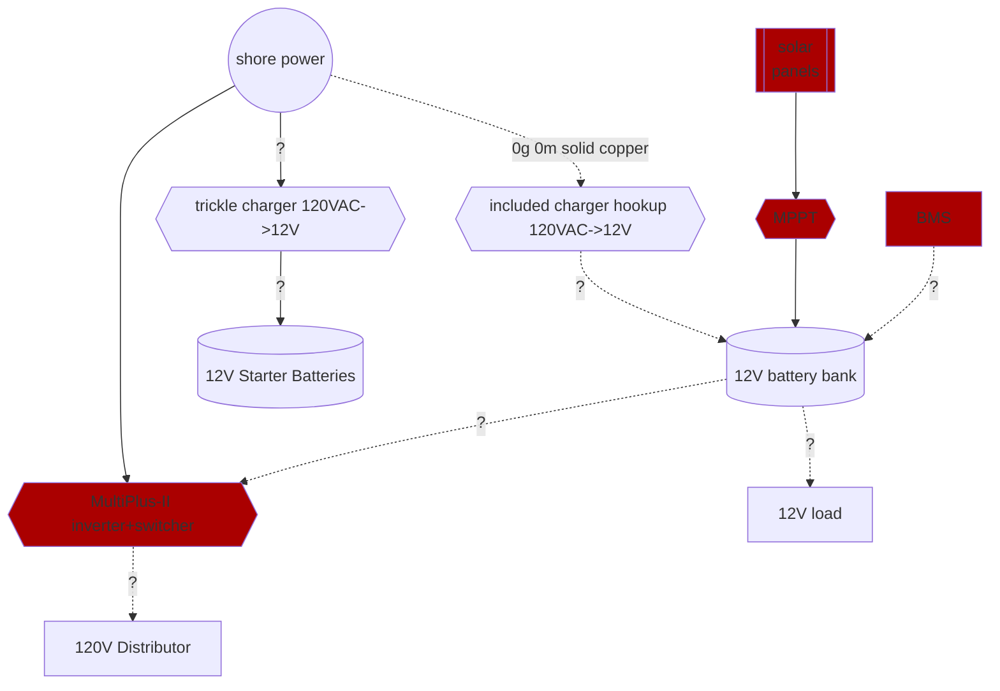

# bbbb
big blue bus build

## useful links
* [vanlifee outfitters load calculation guide](https://www.vanlifeoutfitters.com/sizing-your-electrical-system-load-calculations/)
* [vanlife outfitters recommended parts gsheet](https://docs.google.com/spreadsheets/d/11mebU5YFH1MwnHQXBB2S3vVxYF2hY864WwTCBpQJXPs/edit#gid=0)
* [vanlife outfitters external BMS van build](https://www.vanlifeoutfitters.com/camper-van-electrical-system-with-victron-smart-batteries-and-external-bms/)
    * includes comparison of VE.BUS BMS & LYNX smart BMS
    * includes MPPT

## reference systems:
See [this bbb electrical ref gsheet](https://docs.google.com/spreadsheets/d/1SF7AyHANk0NwJzxiIKbziExU9UKyV6MDn2Jnl_4Plks/edit?usp=sharing) for links & analysis of different electrical diagrams reviewed in the process of designing the bbb electrical system
